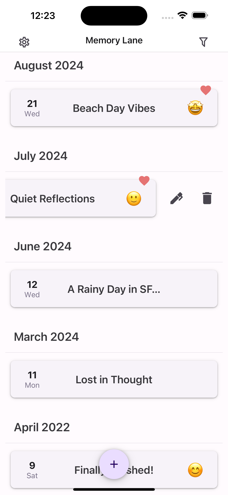
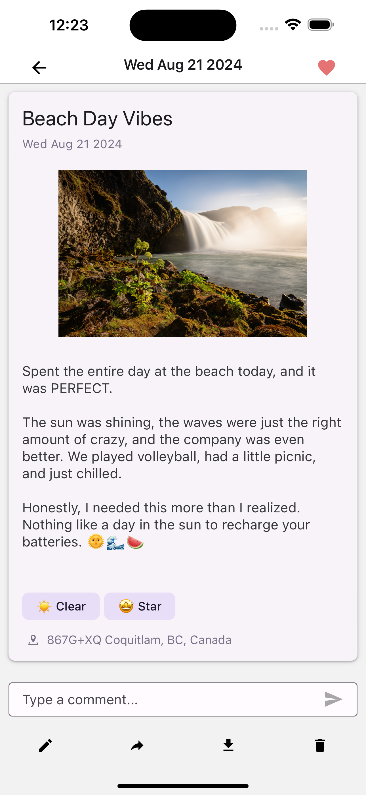
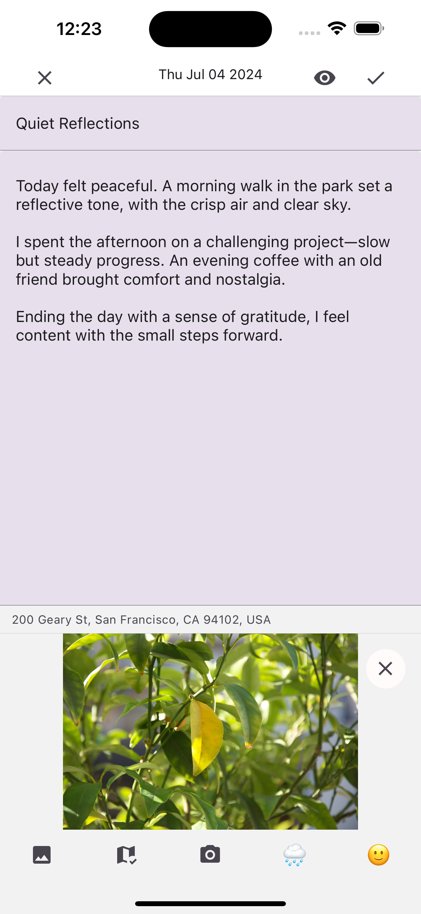
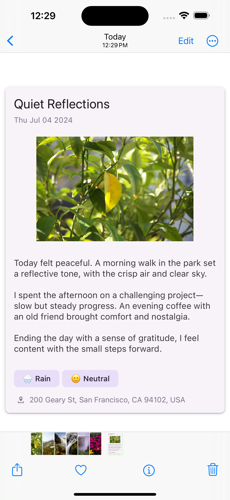

<div align="center">
  <h1 align="center">
    Memory Lane
  </h1>
  <h3 align="center">Capture and Save Your Life's Moments</h3>
</div>

## Overview

**Memory Lane** is a modern digital diary that makes it easy and enjoyable to capture and share your life’s moments. Whether you’re logging daily activities, reflecting on your mood, or commemorating special events, Memory Lane provides a seamless experience. With features to add photos, moods, and locations, your diary entries become vibrant, personalized stories. You can also export your Memory Lane as a beautifully formatted personal journey book for better preservation and sharing.

## Features

- Comprehensive CRUD Operations
  > Effortlessly add, update, delete, and retrieve your logs.
- User Authentication
  > Secure login and signup processes powered by Firebase.
- Export as Image
  > Create a beautiful image of your log for sharing and preservation.
- Comments
  > Engage with other users by commenting their public logs.
- Light and Dark Mode
  > Choose between light and dark themes for a comfortable reading experience.

## Installation

1. Clone the Repository:

   ```sh
   git clone https://github.com/dtszwai/Memory-Lane.git
   cd Memory-Lane
   ```

2. Install Dependencies:

   ```sh
   npm install
   ```

3. Configure Firebase and API Services:

Memory Lane leverages Firebase for authentication, Firestore Database for data storage, and Firebase Storage for file handling. You must set up Firebase with the appropriate security rules and configure the `.env` file with your Firebase project details.

Example Firestore Security Rules:

```text
// 1. Users have full control over their specific data collections
// 2. Publicly flagged 'entries' documents are readable by any authenticated user
// 3. Authenticated users can create comments and likes on these public 'entries'

rules_version = '2';
service cloud.firestore {
  match /databases/{database}/documents {
  	match /public/{logId} {
      allow read, create: if request.auth != null;
      allow update, delete: if request.auth != null && request.auth.uid == resource.data.ownerId;
    }
    match /users/{userId} {
      match /{collectionName}/{logId} {
        allow read, write: if request.auth != null && request.auth.uid == userId;
      }
      match /entries/{entryId} {
        allow read: if get(/databases/$(database)/documents/users/$(userId)/entries/$(entryId)).data.isPublic == true && request.auth != null;
        match /comments/{commentId} {
          allow read, create: if request.auth != null;
        }
      }
    }
  }
}
```

Also, sign up for API keys for the [Google Geocoding API](https://developers.google.com/maps/documentation/geocoding/start) and [OpenWeatherMap](https://openweathermap.org/api), then add them to your .env file.

4. Run the application:

   ```sh
   npm start
   ```

## Project Structure

- `app/`: Contains the main application entry points and modal screens.
- `src/`: Reusable components and utilities, organized by functionality.

## Usage

| **Feature**        | **Description**                                                                                                               |
| ------------------ | ----------------------------------------------------------------------------------------------------------------------------- |
| **View logs**      | Access all your logs on the main screen. Each log includes the date, time, title, and other details.                          |
| **Adding a log**   | Tap the floating action button to create a new log. Add a title, content, mood, location, and photo to your entry.            |
| **Settings**       | Manage your account from the settings screen: update your password, configure notification reminders, and log out of the app. |
| **Authentication** | The app uses Firebase for secure user authentication. Register for a new account or log in with an existing one.              |

### Collections Overview

- **`users`**: The root collection in Firestore. Each user has a document that stores their profile and associated logs.

  - **`entries`**: Contains logs of the user.

    - **`comments`**: Contains comments made by users on public logs.

  - **`trash`**: Contains logs that the user has deleted.

- **`public`**: Contains logs metadata that are publicly viewable. Each document is associated with a user's log.

## Screenshots

<div style="display: flex; flex-direction: row; gap: 20px;">
    
    
    
    
</div>
